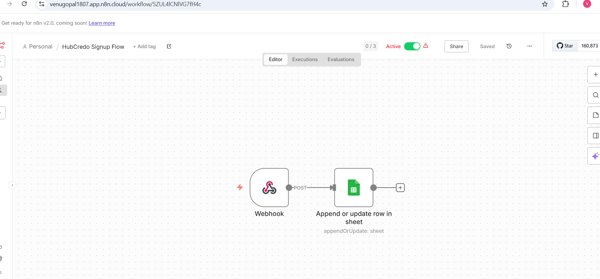
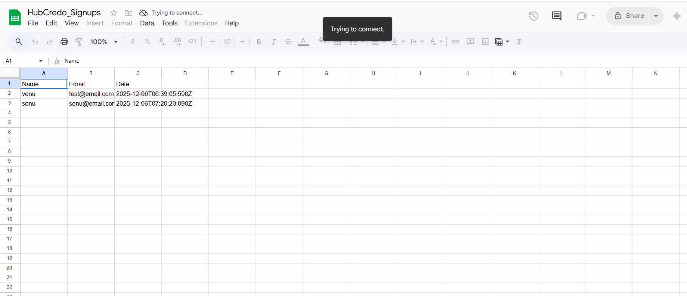

# HubCredo Internship Assignment - Venu Gopal K

## Project Overview
A Full-Stack Web Application (MERN) with secure authentication and an automated workflow integration.
This project demonstrates a complete Signup/Login flow, protected dashboard routes, and a **automation integration** using n8n and Google Sheets.

### Tech Stack
- **Frontend:** React (Vite), TailwindCSS, Axios
- **Backend:** Node.js, Express.js, JWT Authentication
- **Database:** MongoDB Atlas
- **Automation:** n8n (Webhook Integration)

---

## Features: n8n Automation
**Requirement Achieved:** "Add an n8n workflow that gets triggered on every new signup."

I have implemented a live automation pipeline:
1.  **Trigger:** When a user signs up `/api/auth/signup`, the backend sends a payload to a production n8n Webhook.
2.  **Action:** n8n processes the data and automatically appends the user's details to a Google Sheet.

**Work Sample:**

*Above: The active n8n workflow connecting the Webhook to Google Sheets.*


*Above: Real-time data captured in Google Sheets from the application.*

---

## How to Run Locally

### 1. Backend Setup
```bash
cd backend
npm install
# Create a .env file with your credentials:
# MONGO_URI=your_mongodb_connection_string
# JWT_SECRET=your_jwt_secret
# N8N_WEBHOOK_URL=your_n8n_production_url
npm run dev
```
### 2. Frontend Setup
```Bash
cd frontend
npm install
# Note: If running locally, update API_URL in Login.jsx/Signup.jsx to http://localhost:5000/api/auth
npm run dev
```
---
## Implementation Details & Trade-offs

### Why Separate Deployment?
I chose to deploy the Frontend on Vercel and Backend on Render separately (instead of a monolith) to simulate a real-world microservice architecture. This caused some CORS/URL issues initially, but it ensures better scalability.

### The n8n Integration
The hardest part was ensuring the n8n Webhook worked in Production. The "Test URL" worked locally, but I realized I had to switch to the "Production URL" and activate the workflow for the live deployment to function correctly.

### Future Improvements
- **Security:** Currently using `localStorage` for JWT. In a production fintech app, I would switch to `HttpOnly Cookies` to prevent XSS.
- **Validation:** Add stronger Zod validation for email formats on the backend.
